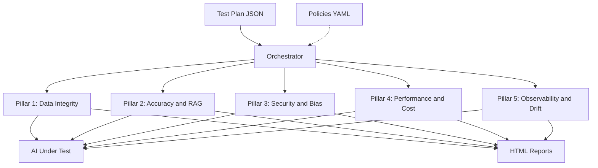
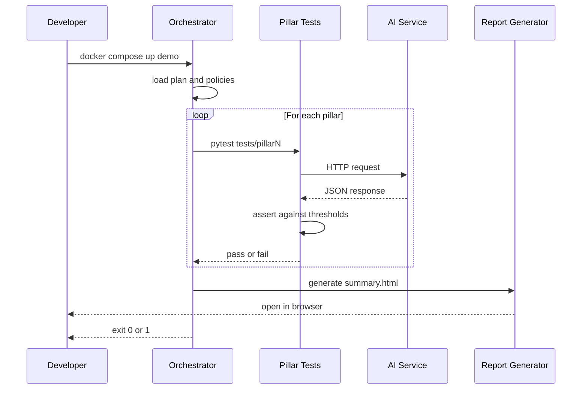

# AI Quality Ops Platform

**End-to-end AI Quality Operations** — continuously validates, monitors, and guards every aspect of an AI product, from training data to production inference.

Five automated quality pillars, orchestrated by a single JSON test plan, producing HTML reports with policy-gated pass/fail decisions.

## Architecture



## Runtime flow



## What it does

Runs five automated quality pillars:

| # | Pillar | What it checks |
|---|---|---|
| 1 | **Data Integrity** | Missing values, duplicates, schema compliance in training/input data |
| 2 | **Accuracy & RAG** | Correct facts, right documents retrieved, faithfulness to context |
| 3 | **Security & Bias** | Prompt injection, toxicity, fairness, PII leakage |
| 4 | **Performance & Cost** | p95 latency, token cost, SLA thresholds |
| 5 | **Observability & Drift** | Metric logging, baseline comparison, drift alerts |

Each pillar reads its thresholds from `policies/`. If a blocking pillar fails, the run aborts with a non-zero exit code — ready for CI.

## Quickstart — one command

```bash
git clone https://github.com/kallurayaankit/ai-quality-ops-platform.git
cd ai-quality-ops-platform
docker compose up demo
```

The demo:

- Spins up a bundled mock AI service (no external dependencies, no submodules)
- Runs all five pillars against it
- Writes `reports/summary.html`
- Exits 0 if all blocking policies pass, 1 otherwise

Open `reports/summary.html` in your browser.

## Policies

Quality gates live in `policies/` as YAML. Each file defines thresholds for one pillar:

```yaml
# policies/accuracy.yaml
pillar: accuracy
blocking: true
metrics:
  correctness:
    threshold: 0.80
    comparison: ">="
  faithfulness:
    threshold: 0.85
    comparison: ">="
  hallucination_rate:
    threshold: 0.10
    comparison: "<="
```

The orchestrator loads every `policies/*.yaml` and passes the thresholds to the pillar tests via environment variables. Change a threshold, re-run, get a different verdict — no code changes.

See [`policies/README.md`](policies/README.md) for the full format.

## Repository layout

```
ai-quality-ops-platform/
├── orchestrator/          # Master runner — reads plan, dispatches pillars
├── tests/
│   ├── pillar1/           # Data integrity
│   ├── pillar2/           # Accuracy & RAG evaluation
│   ├── pillar3/           # Security & bias red-teaming
│   ├── pillar4/           # Performance & cost
│   └── pillar5/           # Observability & drift
├── policies/              # YAML quality gate definitions
├── test_plans/            # JSON test plans & baselines
├── demo/                  # Self-contained mock AI service
├── reports/               # Generated HTML reports
├── qa_service/            # QA-as-a-Service REST API + web UI
├── mock_ai_service/       # Example AI endpoint for testing
├── docs/                  # Architecture diagrams, sample reports
├── Dockerfile
├── docker-compose.yml
└── .github/workflows/     # CI/CD pipeline
```

## Tech stack

Python · pytest · FastAPI · uvicorn · Docker & Docker Compose · GitHub Actions · pytest-html

## License

MIT — see [LICENSE](LICENSE).

## Author

Ankit Kalluraya — AI Quality Architect | Staff QA Engineer
